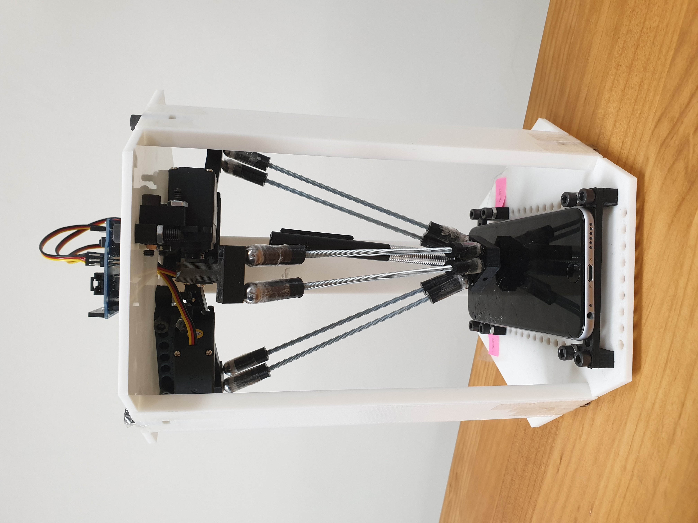

# Introduce

##                                

## 1. 프로젝트 링크: 

[https://drive.google.com/file/d/1eR7OXjWO4xDGgXbri4CsqUKaFTqJsIeV/view?usp=sharing](https://drive.google.com/file/d/1eR7OXjWO4xDGgXbri4CsqUKaFTqJsIeV/view?usp=sharing)

## 2. 실행영상:  

[https://drive.google.com/file/d/1ycMfCBhe8VxPUW1sKu8O3T8NEOGJAYyP/view?usp=sharing](https://drive.google.com/file/d/1ycMfCBhe8VxPUW1sKu8O3T8NEOGJAYyP/view?usp=sharing)

## 3. Github Url: 

[https://github.com/kimSooHyun950921/Mobile-Performance](https://github.com/kimSooHyun950921/Mobile-Performance)

